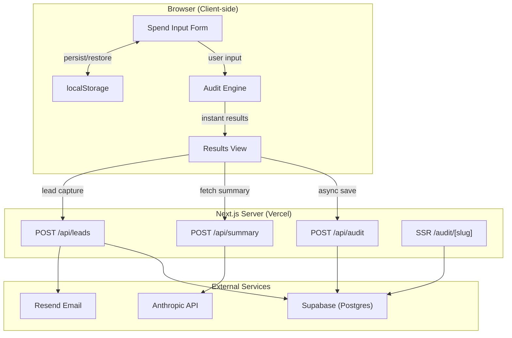

# Architecture — StackAudit

## System Overview

## Data Flow

### Happy Path: User → Audit → Save → Share

1. **User fills form** → Tool entries stored in React state + `localStorage`
2. **Clicks "Run Audit"** → `runAudit()` executes client-side in <5ms
3. **Results render instantly** → No network request for audit logic
4. **AI summary loads** → `POST /api/summary` calls Anthropic API (or template fallback)
5. **User clicks "Share"** → `POST /api/audit` saves to Supabase, returns slug
6. **User copies link** → `/audit/[slug]` is server-rendered with dynamic OG tags
7. **Lead capture** → `POST /api/leads` saves email, sends Resend confirmation

### Fallback Behavior

| Failure | Fallback | User Impact |
|---------|----------|-------------|
| Supabase down | Mock slug returned, audit not persisted | Share button works but link won't resolve |
| Anthropic API fails | Template-based summary generated from audit data | Summary still useful, just formulaic |
| Resend fails | Lead saved to Supabase, email silently skipped | User doesn't get email, but lead is captured |
| Rate limit hit | 429 response | User told to try again later |
| Invalid shared link | 404 page with "Run your own audit" CTA | Clean recovery path |

## Architecture Decisions

### Why Client-Side Audit Engine?
The audit logic is a pure function: `(tools, teamSize, useCase) → recommendations`. There's no secret sauce — the pricing data is public. Running client-side gives:
- **Instant results** (0 network latency)
- **Works offline** after first load
- **No server cost** for compute
- **Testable** with standard unit tests (Vitest)

### Why Server-Rendered Share Pages?
The `/audit/[slug]` page MUST be server-rendered because:
- Social media crawlers (Twitter, LinkedIn, Slack) don't execute JavaScript
- Dynamic OG tags (`This team saves $X/mo`) require server-side metadata
- SEO benefit for organic discovery

### Rate Limiting Strategy
In-memory rate limiting at 5 submissions/hour/IP. This resets on cold starts (serverless), which is acceptable because:
- The attack surface is low (free tool, no payment)
- Real abuse would need sustained volume across restarts
- A persistent rate limiter (Redis) would be over-engineering for an MVP

### Database Schema
Two tables with a foreign key relationship:
- `audits` — stores the full audit input/output as JSONB
- `leads` — stores email + optional fields, linked to audit

Using JSONB for `tools_data` and `results_data` avoids schema migration when adding new tools or recommendation types. Trade-off: no SQL queries against individual tool fields, but that's fine for an MVP.

## Security

- `.env.local` never committed (in `.gitignore`)
- Supabase Row Level Security enabled on both tables
- Honeypot field on lead capture form
- IP-based rate limiting on lead submissions
- No PII exposed on shared audit pages
- HTTPS enforced via Vercel
